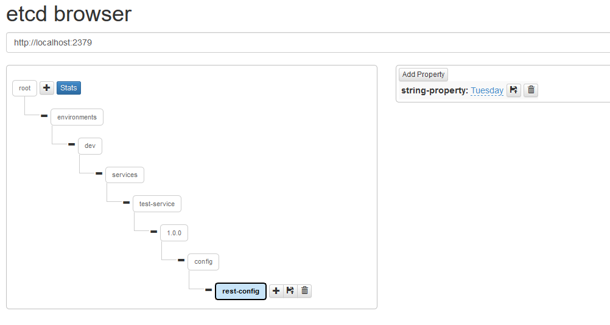

# KumuluzEE Node.js Config

> read local or remote configuration in kumuluzEE format.

The goal of this sample is to demonstrate how to use library for configuration in Node.js. The tutorial will guide you through the necessary steps. 

## Requirements

In order to run this sample you will need:
1. Node.js version >=8.0.0 installed. 
  * If you have Node.js installed, you can check your version by typing the following in command line:
  ```
    node -v
  ```
2. NPM version >= 5.5.0 installed.
  * If you have NPM installed, you can check your version by typing the following in command line:
   ```
     npm -v
   ```
3. Git:
  * If you have installed Git, you can check the version by typing the following in a command line:
  ```
    git --version
  ```
  
## Prerequisites

To run this sample you will need an etcd instance. Note that such setup with only one etcd node is not viable for 
production environments, but only for developing purposes. Here is an example on how to quickly run an etcd instance 
with docker:

   ```bash
    $ docker run -d -p 2379:2379 \
      --name etcd \
      --volume=/tmp/etcd-data:/etcd-data \
      quay.io/coreos/etcd:latest \
      /usr/local/bin/etcd \
      --name my-etcd-1 \
      --data-dir /etcd-data \
      --listen-client-urls http://0.0.0.0:2379 \
      --advertise-client-urls http://0.0.0.0:2379 \
      --listen-peer-urls http://0.0.0.0:2380 \
      --initial-advertise-peer-urls http://0.0.0.0:2380 \
      --initial-cluster my-etcd-1=http://0.0.0.0:2380 \
      --initial-cluster-token my-etcd-token \
      --initial-cluster-state new \
      --auto-compaction-retention 1 \
      -cors="*"
   ```

It is also recommended that you are familiar with Node.js environment.

## Usage

This example is installed and run with NPM.

1. Install dependencies using NPM: `$ npm install`
2. Run the sample
  * using Configuration Util:
  ```bash
    $ npm run start:util
  ```
  * using Config Bundle:
  ```bash
    $ npm run start:bundle
  ```  
  
Application can be accessed on the following URL:
* http://localhost:3000/

To shut down the example simply stop the processes in the foreground.

## Tutorial

This tutorial will guide you through the steps required to read local and remote configuration.

We will develop light Express application which will read configuration and return it in json format.

We will follow this steps:
* Create NPM project
* Install required dependencies
* Initialize configuration
* Run it

### Create NPM project

We can create blank NPM project by typing `$ npm init` in command line.

During this process you will be asked to choose the name, version, etc. of your project. You can keep all the defaults by pressing enter. 

When project is initialized you will get a file called package.json. Optionally you can setup start script, so that your project can be run using `$ npm start`:
```json
"scripts": {
    "start": "node index.js"
  },
``` 

### Install required dependencies
Since we will use Express framework to setup server we need to install it by typing this in command line:
```bash
$ npm install --save express
```

Now, we install KumuluzEE Config library:
```bash
$ npm install --save @kumuluz/kumuluzee-config
```

### Initialize configuration

First, we are going to create file called **config.yaml**, where we will write our application's configuration:

```yaml
kumuluzee:
  # name of our service
  name: test-service
  server:
    # url where our service will live
    base-url: http://localhost:3000
    http:
      port: 3000
  env: 
    name: dev
  config:
    etcd:
      # url of our etcd server we setup before
      hosts: http://localhost:2379
# our custom configuration
rest-config:
  string-property: Monday
  boolean-property: true
  integer-property: 23
  object-property:
    sub-property: Object property value
    sub-property-2: Another object property value
```

#### Using configuration util 

In folder **/util** we will create a file **index.js**.

There we will require Express dependency and setup a simple server:
```javascript 1.7
const express = require("express");
const server = express();

server.get("/", async (request, response) => {
    // here we will perform lookup
});

server.listen(3000, () => console.log("server running on port 3000!"));
```
Now that we have a running server, we can implement configuration lookup:

First we need to initialize our configuration source:
```javascript 1.7
// get path library (part of nodejs core)
const path = require("path");

// get ConfigurationUtil
const ConfigurationUtil = require("@kumuluz/kumuluzee-config").ConfigurationUtil; 

// define path to our config.yaml
const configurationPath = path.join(__dirname, "..", "config.yaml");

// define init function
let util = null;

const init = async () => {
    await ConfigurationUtil.initialize({
        extension: "etcd",
        configPath: configurationPath
    });
    util = ConfigurationUtil;
};

// call init function
init();
```
Now we can update our **GET /** function to perform lookup of configuration:
```javascript 1.7
server.get("/", async(req, res) => {
    const stringProperty = await util.get("rest-config.string-property");
    res.json({value: stringProperty});
});
```
Response should be:
```json
{
  "value": "Monday"
}
```

#### Using config bundle

In folder **/bundle** we will create a file **index.js**.

There we will require Express dependency and setup a simple server:
```javascript 1.7
const express = require("express");
const server = express();

server.get("/", async (request, response) => {
    // here we will perform lookup
});

server.listen(3000, () => console.log("server running on port 3000!"));
```
Now that we have a running server, we can implement configuration lookup.

First we create file called **bundle.js** and we prescribe how our config bundle will look like:
```javascript 1.7
const ConfigBundle = require("@kumuluz/kumuluzee-config").default;

const remoteConfig = new ConfigBundle({
    prefixKey: "rest-config",
    type: "object",
    fields: {
        stringProperty: { // custom name to be used in code
            type: "string",
            name: "string-property", // name as it is written in config.yaml
            watch: true // if true, it will automatically update value received from remote config
        },
        integerProperty: {
            type: "number",
            name: "integer-property"
        },
        booleanProperty: {
            type: "boolean",
            name: "boolean-property"
        },
        objectProperty: {
            type: "object",
            name: "object-property",
            fields: {
                subProperty: {
                    type: "string",
                    name: "sub-property"
                },
                subProperty2: {
                    type: "string",
                    name: "sub-property-2"
                }
            }
        }
    }
});

exports.remoteConfig = remoteConfig;
```

Now all we need to do is to import this bundle and initialize it:
```javascript 1.7
const remoteConfig = require("./bundle").remoteConfig;

let util = null;

const init = async () => {
    await remoteConfig.initialize({
        extension: "etcd",
        configPath: configurationPath
    });
    util = ConfigurationUtil;
};

init();
```

And now we edit our **GET /** function to perform lookup:
```javascript 1.7
server.get("/", async (req, res) => {
    const stringProperty = await util.get("rest-config.string-property");
    const integerProperty = remoteConfig.integerProperty;
    const objectProperty = remoteConfig.objectProperty.subProperty;
    res.json({
        val_from_util: stringProperty,
        val_from_bundle: integerProperty,
        val_from_bundle_2: objectProperty
    });
});
```
Response should be:
```json
{
  "val_from_util":"Monday",
  "val_from_bundle":23,
  "val_from_bundle_2":"Object property value"
}
```

Since we set watch for string-property, if this configuration changes, the response will change.
To change value in etcd you can use its api, or GUI tool like [etcd browser](http://henszey.github.io/etcd-browser/):


Response should now be:
```json
{
  "val_from_util":"Tuesday",
  "val_from_bundle":23,
  "val_from_bundle_2":"Object property value"
}
```
 