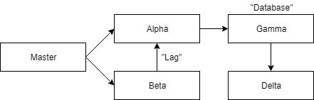

# KumuluzEE OpenTracing tutorial

This is a starting point for the tutorial, published on the [KumuluzEE blog](https://blog.kumuluz.com/developers/community/2019/02/11/kumuluzee-opentracing-jaeger). Finished project is available on branch _opentracing_tutorial_finished_. It is designed purely for purposes of demonstrating OpenTracing, which is why the only thing these microservices do is communicate with each other using HTTP requests. It is also beginner friendly due to the code being really simple.

## Structure
Project consists of 5 microservices:
1. __master__ - This is the entry point of the application. It is served on `http://localhost:8080` (actual endpoint on `v1/master`). When queried, it makes two requests: to _alpha_ endpoint  `v1/alpha` and to _beta_ endpoint `v1/beta`.
2. __alpha__ - This is the first of 4 "slave" microservices. It is served on `http://localhost:8081` and has two endpoints: `/v1/alpha` (just returns value) and `/v1/alpha/beta`, which queries _gamma_ endpoint `v1/gamma`.
3. __beta__ - This is the second of 4 "slave" microservices. It is served on `http://localhost:8082` and has one endpoint: `/v1/beta`, which queries _alpha_ endpoint `/v1/alpha/beta`. Simulated lag is added to this request (random delay).
4. __gamma__ - This is the third of 4 "slave" microservices. It is served on `http://localhost:8083` and has one endpoint: `/v1/gamma`, which queries _delta_ endpoint `/v1/delta`. This microservice is different, because it uses a simulated database with CDI.
5. __delta__ - This is the last of 4 "slave" microservices. It is served on `http://localhost:8084` and has one endpoint: `/v1/delta`, which just return a value.



## Requirements

In order to run this example you will need the following:

1. Java 8 (or newer), you can use any implementation:
    * If you have installed Java, you can check the version by typing the following in a command line:
        
        ```
        java -version
        ```

2. Maven 3.2.1 (or newer):
    * If you have installed Maven, you can check the version by typing the following in a command line:
        
        ```
        mvn -version
        ```
3. Git:
    * If you have installed Git, you can check the version by typing the following in a command line:
    
        ```
        git --version
        ```

## Usage

The example uses maven to build and run the microservices.

1. Build the sample using maven:

    ```bash
    $ cd kumuluzee-opentracing-tutorial
    $ mvn clean package
    ```

2. Run the sample (all five microservices):
* Uber-jar:

    ```bash
    $ java -jar target/${project.build.finalName}.jar
    ```
    
    in Windows environemnt use the command
    ```batch
    java -jar target/${project.build.finalName}.jar
    ```

* Exploded:

    ```bash
    $ java -cp target/classes:target/dependency/* com.kumuluz.ee.EeApplication
    ```
    
    in Windows environment use the command
    ```batch
    java -cp target/classes;target/dependency/* com.kumuluz.ee.EeApplication
    ```
    
The microservices can be accessed on the following URLs:
* Master microservice main endpoint - http://localhost:8080/v1/master
* Alpha microservice endpoint 1 - http://localhost:8081/v1/alpha
* Alpha microservice endpoint 2 - http://localhost:8081/v1/alpha/beta
* Beta microservice endpoint - http://localhost:8082/v1/beta
* Gamma microservice endpoint - http://localhost:8083/v1/gamma
* Delta microservice endpoint - http://localhost:8084/v1/delta

To shut down the example simply stop the processes in the foreground.


